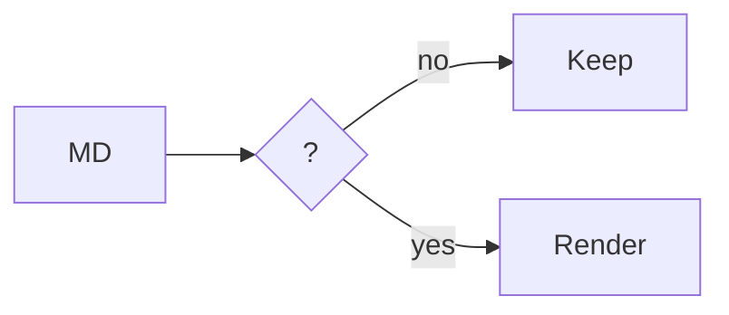

# Downright renderer showcase

**Inline** · **bold** · _italic_ · ~~strike~~ · `code`

**Links** · [open](https://x.com) · [[wiki]] · <https://x.com> · note[^1]

**Math** · $e^{i\pi}+1=0$ · $\sqrt{x^2+y^2}$ · `$PATH`

| Surface | Proof |
|---|---|
| `Model` | **pass** |

> [!NOTE]
> Native: prose + source + state + media.

- [x] Code · math · Mermaid · table · task

**Syntax** · comments, keywords, types, strings, numbers, calls:

```swift
@MainActor func render(_ source: String) -> NSImage? {
    let features = ["math", "mermaid"]
    return cache.image(for: source) { print(features.count) }
}
```

**Math**

$$
\mathop{\mathrm{read}}(source) \longrightarrow \mathop{\mathrm{render}}(surface)
$$

**Mermaid**



## Lower anchors

This lower shelf gives the document map real structure without competing with the proof above.

### Source

`sample.md` stays the source of truth while the rendered surface stays native.

### State

Links, callouts, tasks, and math retain their local state as the page grows.

### Finish

The rail is now a compact section index, not a lone tick.

[^1]: Footnotes resolve locally without moving the reader away from the line.
