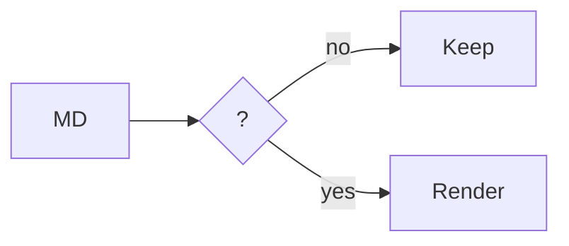

# Renderer handoff: the file stays readable

This is the working note for the renderer refactor. The page is a review
surface for a file people and coding agents change together: the source stays
plain, the document stays legible, and every decision has a place to land.

**Inline** · **bold** · _italic_ · ~~deprecated~~ · `RenderedDocument`

**Links** · [open the issue](https://github.com/ezzy1630/Downright/issues) · [[Renderer]] · <https://downright.cc> · note[^1]

**Math** · $e^{i\pi}+1=0$ · $\sqrt{x^2+y^2}$ · `$PATH`

| Surface | State | Proof |
|---|---|---|
| `Parse` | **stable** | immutable block index |
| `Decorate` | **measured** | one pass per keystroke |
| `Review` | **visible** | word-level change marks |

> [!NOTE]
> Native: prose, source, state, and media in one surface.

- [x] Parse once and decorate from ranges
- [x] Keep raw bytes available for review
- [ ] Move the image store off the main actor

**Syntax** · comments, keywords, types, strings, numbers, and calls:

```swift
@MainActor func render(_ source: String) -> RenderedDocument {
    let index = parser.blockIndex(for: source)
    let image = cache.image(for: index)
    return decorator.apply(image, ranges: index.ranges)
}
```

**Math**

$$
\mathop{\mathrm{parse}}(bytes) \longrightarrow \mathop{\mathrm{decorate}}(surface)
$$

**Mermaid**



## Review anchors

The document map draws from this same structure, so every altitude has a floor to stand on.

### Source

The handoff stays source-first while the rendered surface stays native.

### State

Links, callouts, tasks, and math retain their local state as the page grows.

### Finish

This note stays useful after the agent leaves because its structure remains visible.

[^1]: Footnotes resolve locally without moving the reader away from the line.
